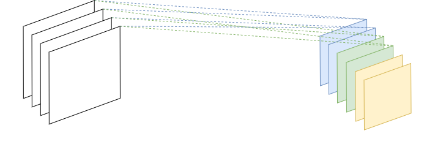

# IDDL: An Integrated Distributed Deep Learning framework

Deep learning

## BIBD

Balanced Incomplete Block Design (BIBD) is the core technique in this project.

[bibd_visualization.ipynb](https://nbviewer.jupyter.org/github/DerekDick/iid2019-final-project/blob/master/bibd/bibd_visualization.ipynb)

### BIBD convolution

Depthwise sparsification

## MLP experiments

Three models:
- MLP
- MLP with BIBD
- Random sparse MLP

You can check the live Jupyter Notebook here: [mlp_bibd_experiments.ipynb](https://nbviewer.jupyter.org/github/DerekDick/iid2019-final-project/blob/master/mlp/mlp_bibd_experiments.ipynb)

## Experiment settings and criterions

### Settings

The experiments are performed under combinations of the following three settings, which are **orthogonal** to each other.

#### Sparsification

- _Linear layers_

    - No sparsification
    - BIBD
    - Random sparsification

- _Convolutional layers_

    Depthwise sparsification (channel)
    
    - No sparsification
    - BIBD
    - Random sparsification
    - Grouped convolution

#### Vertical

- No vertical partitioning or ensemble learning
- Vertical partitioning without ensemble learning
- Vertical partitioning with ensemble learning

#### Horizontal

- No early exiting
- Early exiting

### Criterions

- Training loss, test accuracy per epoch
- Training time, inference time
- \# of parameters, FLOPs (inference stage)

## Setup development environment

See [setup.md](./setup.md)

## Experiments data record

| model | dataset | epoch | training time | test accuracy | Params | FLOPs |
|---|---|---|---|---|---|---|
| MLP | MNIST | 10 | 1m54s | 97% | 94640 | ? |
| B-MLP | MNIST | 10 | 1m58s | 90% | 4266 | ? |
| R-MLP | MNIST | 10 | 2m2s | 90% | 4266 | ? |
| mlp | cifar10 | 100 | 23min 25s | 50.7% | ? | 0.31M |
| mlp_bibd | cifar10 | 100 | 20min 36s | 48.9% | ? | 0.30M |
| resnet18 | cifar10 | 30 | (total) 35m22s | 81.440% | ? | 557.89M |
| resnet18_bibd | cifar10 | 30 | (total) 36m13s | 77.010% | ? |
| resnet18_gc2 | cifar10 | 30 | (total) 24m35s | 89.01% | | |
| resnet18_bibd_gc2 | cifar10 | 30 | (total) 33m20s | 86.86% | | |
| resnet18_gc4 | cifar10 | 30 | (total) 23m30s | 88.38% | | |
| resnet18_bibd_gc4 | cifar10| 30 | (total) 33m23s | 87.35% | | |
| resnet18 + vertical partitioning | cifar10 | 30 | (total) 22m35s | 83.830% |  |  |

### Ensemble results

| Ensemble method | Dataset | Base classifier | Ensemble acc | Base acc list | # of ensemble | # of epoch   (for training single base classifier) |
|---|---|---|---|---|---|---|
| AdaBoost (SAMME) | MNIST | MLP | 96.00% | 94.11% 94.74% 93.50% 93.31% 93.56% 94.37% 93.97% 94.10% 95.19% | 9 | 1 |
| AdaBoost (SAMME) | CIFAR10 | resnet_bibd_gc | 24.36% | 31.85% 28.80% 20.68% 22.85% 20.61% 20.04% 24.13% 22.06% 23.60% | 9 | 1 |

Hardware info:
- GPU name: GeForce GTX 970
- GPU memory: 4GB
- GPU count: 1
- Cuda version: 10.2
- Driver version: 440.33.01
