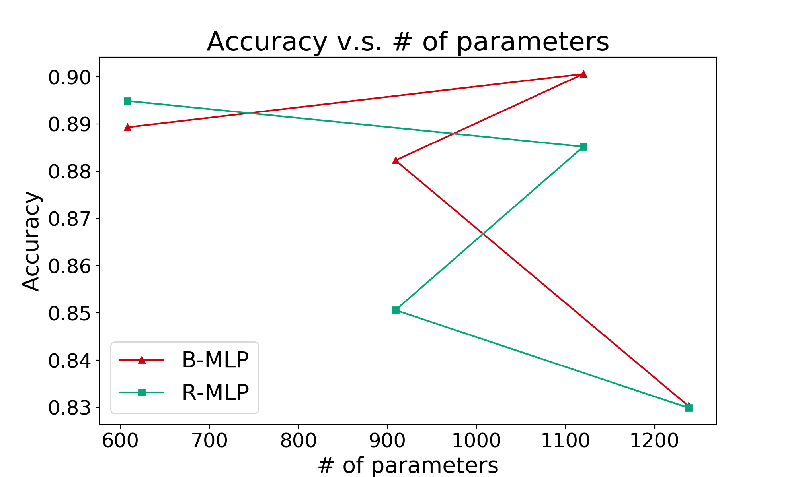
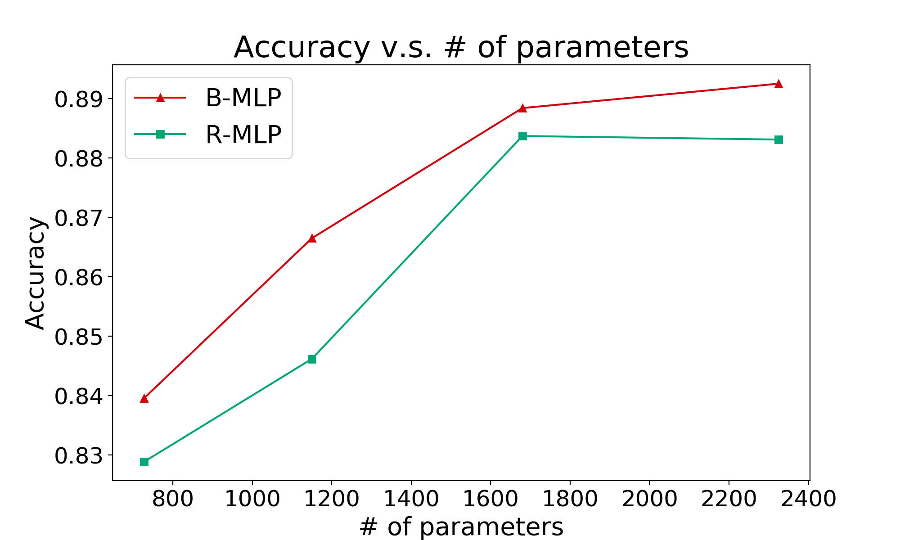
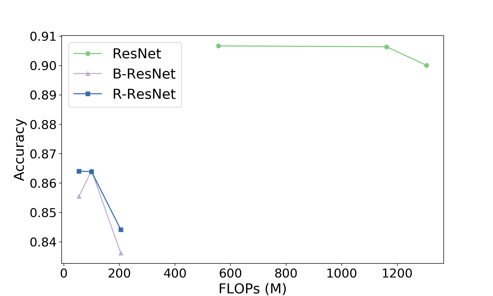
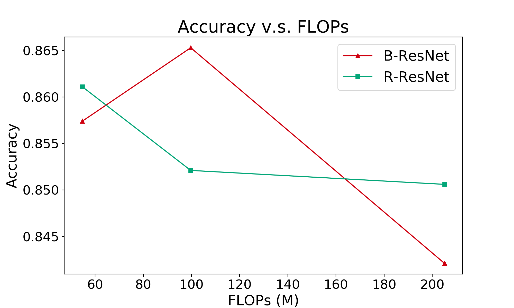
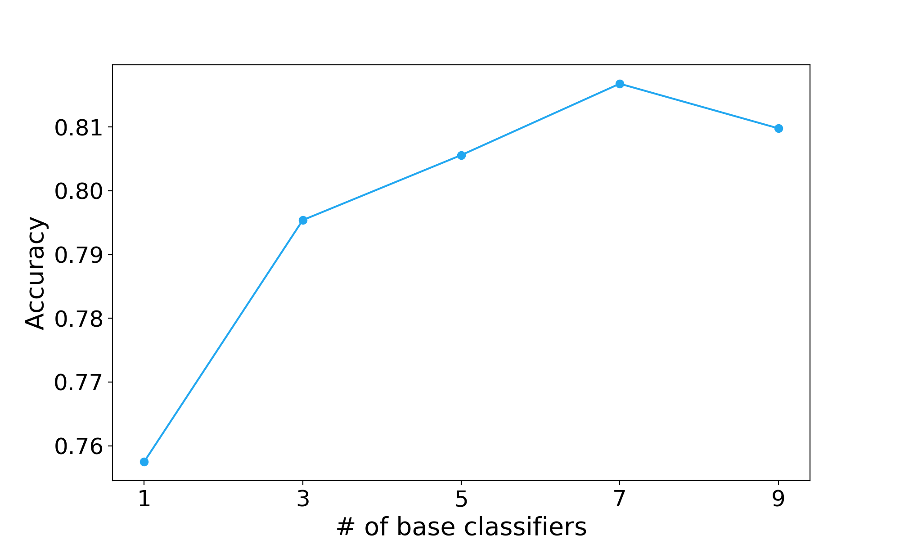

# IDDL: An Integrated Distributed Deep Learning framework

## 1. BIBD

Balanced Incomplete Block Design (BIBD) is the core technique in this project.

[bibd_visualization.ipynb](https://nbviewer.jupyter.org/github/iid2019/iddl/blob/master/bibd/bibd_visualization.ipynb)

### 1.1 BIBD linear layers

### 1.2 BIBD convolutional layers

Depthwise (channel) sparsification


## 2. MLP experiments

Three models:
- MLP
- MLP with BIBD
- Random sparse MLP

You can check the live Jupyter Notebook here: [mlp_bibd_experiments.ipynb](https://nbviewer.jupyter.org/github/DerekDick/iid2019-final-project/blob/master/mlp/mlp_bibd_experiments.ipynb)

## 3. Experiment settings and criterions

### 3.1 Settings

The experiments are performed under combinations of the following three settings, which are **orthogonal** to each other.

#### 3.1.1 Sparsification

- _Linear layers_

    - No sparsification
    - BIBD
    - Random sparsification

- _Convolutional layers_

    Depthwise sparsification (channel)
    
    - No sparsification
    - BIBD
    - Random sparsification
    - Grouped convolution

#### 3.1.2 Vertical

- No vertical partitioning
- Vertical partitioning

#### 3.1.3 Horizontal

- No early exiting
- Early exiting

#### 3.1.4 Ensemble learning

Ensemble learning techniques are applied to improve inference accuracy.

- Ensemble learning
- Without ensemble learning

### 3.2 Criterions

- Training loss, test accuracy per epoch
- Training time, inference time
- \# of parameters, FLOPs (inference stage)

## 4. Setup development environment

See [setup.md](./setup.md)

## 5. Experiments

[iddl_experiments.pdf](https://github.com/iid2019/iddl-paper/blob/master/experiments/iddl_experiments.pdf)

### 5.1 BIBD

#### 5.1.1 MLP based models

**Run the experiment**

```shell
$ conda activate iddl_env
$ cd mlp
$ ./run_mlp_experiments.sh
```

- Log file: `./mlp/log/mlp_experiments_${BEGIN_TIME}.log`
- PID file: `./mlp/log/mlp_experiments_${BEGIN_TIME}_pid.txt`
- Dumped file: `./mlp/mlp_experiments_${BEGIN_TIME}.p` can be unpicked as an instance of `Experiment` class

**Plot the results**

```shell
$ conda activate iddl_env
$ cd mlp
$ python plot_mlp_experiments.py
```

- Figures: `./mlp/mlp_experiments.png`, `./mlp/mlp_experiments.eps`, `./mlp/mlp_experiments_sparse_only.png`, `./mlp/mlp_experiments_sparse_only.eps`
- Log: `./mlp/log/mlp_experiments_plot_{BEGIN_TIME}.log`

**Results**

| Model | \# of parameters | FLOPs | Accuracy |
|---|---|---|---|
| MLP-3-1 | 13064 |  | 0.9486 |
| MLP-3-2 | 20650 |  | 0.9556 |
| MLP-3-3 | 30156 |  | 0.9583 |
| MLP-3-4 | 41720 |  | 0.9646 |
| B-MLP-3-1 | 728 |  | 0.8396 |
| B-MLP-3-2 | 1150 |  | 0.8665 |
| B-MLP-3-3 | 1680 |  | 0.8884 |
| B-MLP-3-4 | 2324 |  | 0.8925 |
| R-MLP-3-1 | 728 |  | 0.8289 |
| R-MLP-3-2 | 1150 |  | 0.8462 |
| R-MLP-3-3 | 1680 |  | 0.8837 |
| R-MLP-3-4 | 2324 |  | 0.8831 |





#### 5.1.2 ResNet based models

**Run the experiments**

```shell
$ conda activate iddl_env
$ cd resnet
$ bash run_resnet_experiments.sh
```

- Log file: `./resnet/log/resnet_experiments_${BEGIN}.log`
- `./resnet/accuracy_array_{BEGIN}.pkl`: The pickled file of the array of test accuracy of type `numpy.array`.
- `./resnet/model_name_array_{BEGIN}.pkl`: The pickled file of the array of model names of type `numpy.array`.

**Plot the results**

```shell
$ conda activate iddl_env
$ cd resnet
$ python plot_resnet_experiments.py
```

- `./resnet/fig_resnet_experiments.eps`, `./resnet/fig_resnet_experiments.png`
- `./resnet/fig_resnet_experiments_sparse_only.eps`, `./resnet/fig_resnet_experiments_sparse_only.png`: Only include the legends of sparse models: B-ResNet and R-ResNet.

**Results**


|  | *-ResNet-18 | *-ResNet-34 | *-ResNet-50 |
|---|---|---|---|
| **No sparsification** | 556.65 | 1161.45 | 1304.69 |
| **BIBD sparsification** | 54.71 | 99.70 | 205.03 |
| **Random sparsification** | 54.71 | 99.70 | 205.03 |





### 5.2 Vertical partitioning

Implemented using grouped convolution.

### 5.3 Horizontal partionining

Early exiting.

### 5.4 Ensemble learning

**Run the experiments**

```shell
$ cd resnet
$ conda activate iddl_env
$ bash ./run_ensemble_experiments.sh 1
$ bash ./run_ensemble_experiments.sh 2
```

- Log file: `./resnet/log/ensemble_experiments_${INDEX}_${BEGIN}.log`
- PID file: `log/ensemble_experiments_${INDEX}_${BEGIN}.pid`
- Dumped file: `ensemble_result_${INDEX}_${BEGIN}.pkl`

**Plot the results**

```shell
$ cd resnet
$ conda activate iddl_env
$ python plot_ensemble_experiments.py
```

- `./resnet/fig_ensemble_experiments.png`, `./resnet/fig_ensemble_experiments.eps`
- `./resnet/fig_ensemble_experiments_improved.png`, `./resnet/fig_ensemble_experiments_improved.eps`



## 6. Get involved

Please follow the instructions if you want to contribute to this repository: [contribution_guide.md](./contribution_guide.md)

### 6.1 Style guide

- [Google Python Style Guide](http://google.github.io/styleguide/pyguide.html)
